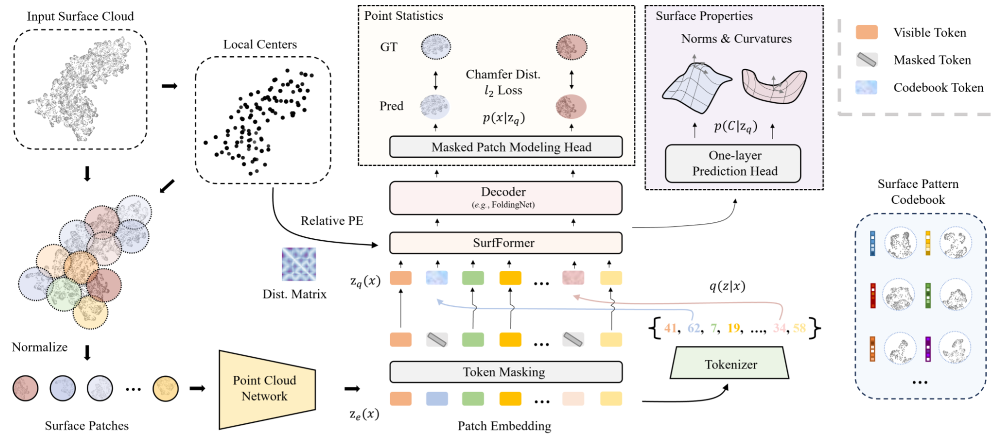

# 🐾Surface-VQMAE🐾 
This is the official repo of **urface-VQMAE: Vector-quantized Masked Auto-encoders on Molecular Surfaces** (**ICML 2024**), 
where a novel self-supervised algorithm is proposed to employ the abundant unlabeled molecular surfaces. 
**Note:** there are some improvements and differences from the initial version described in the ICML paper.
👉 (1) We provide a PyMol-based mechanism to produce protein surfaces, in additional to the fast-sampling method in dMaSIF. 
👉 (2) We modify the point cloud network and delete the calculation of tangent vectors, since those tangent vectors are not equivariant.  

<p align="center"></p>

## Install
### Environment
We use Python 3.7.11 with cuda-version 12.0. Please run the following command to install necessary packages. 
```bash
pip install -r requirements.txt
cd ./ep_ab/utils/chamfer_dist
python setup.py install --user
```
[//]: # (pip3 freeze > requirements.txt)

### Datasets 
We use [`PDB-REDO`](https://pdb-redo.eu/) as the pretraining resource. You can run to download the entire dataset:
```markdown
rsync -avuP \
    --include='*_final.cif' \
    --include='*/' \
    --exclude='*' \
    rsync://rsync.pdb-redo.eu/pdb-redo
    ./PDB_REDO
```
For downstream task evaluation, we provide an example here, namely, the epitope prediction challenge. 
Protein structures in the `SAbDab` dataset (Data version: **2023.09.23**) can be downloaded 
[**here**](https://opig.stats.ox.ac.uk/webapps/newsabdab/sabdab/archive/all/). 
Extract `all_structures.zip` into the `data` folder.  The `data` folder contains a snapshot of the dataset index (`sabdab_summary_all.tsv`). 
You may replace the index with the latest version [**here**](https://opig.stats.ox.ac.uk/webapps/newsabdab/sabdab/summary/all/).

[//]: # (## Data Preprocessing)
[//]: # (```markdown)
[//]: # (python preprocess.py)
[//]: # (```)

## Pretraining
```bash
python vae.py ./configs/train/vae.yml
```

## Train
```bash
python train.py ./configs/train/surfformer.yml
```

[//]: # (## Reference)

## Contact and Cite
If you are interested in our work and recognize our contributions, please cite it! 
Also, please do not hesitate to [email me]((mailto:fangwu97@stanford.edu)) (*fangwu97@stanford.edu*) immediately if you have any sort of questions or 
fancy points that deserve further communication. 
```bibtex
@article{fangsurface,
  title={Surface-VQMAE: Vector-quantized Masked Auto-encoders on Molecular Surfaces},
  author={Fang, WU and Li, Stan Z}
}
```
